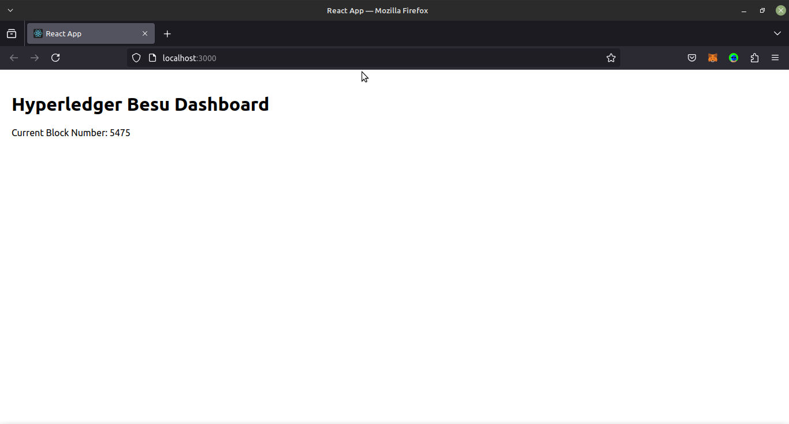

# Besu Dashboard Project

This repository contains two primary components:

1. **Backend**: An API that integrates with the Hyperledger Besu network to fetch blockchain data (e.g., block numbers).
2. **Frontend**: A React-based dashboard displaying the current block number retrieved via the API.

---

## Features

### Backend
- Built with Node.js and Express.
- Connects to the Hyperledger Besu network.
- Provides a RESTful API endpoint to fetch the current block number.
- Handles CORS to enable secure communication with the frontend.

### Frontend
- Built with React and TypeScript.
- Uses Axios to fetch data from the backend API.
- Displays the current block number in a clean and responsive UI.

---

## Prerequisites

- Node.js (v14 or higher)
- Yarn package manager
- Docker (optional, for running Hyperledger Besu locally)
- A running instance of a Hyperledger Besu network

---

## Backend Setup

1. **Install Dependencies**
   ```bash
   cd backend
   yarn install
   ```

2. **Start the Server**
   ```bash
   yarn start
   ```
   The server will run on `http://localhost:3001` by default.

3. **Endpoints**
   - `/blockNumber`: Returns the latest block number from the Besu network.

4. **CORS Configuration**
   The backend includes middleware to handle CORS errors. It ensures that requests from the frontend’s origin are accepted:
   ```javascript
   const cors = require('cors');
   app.use(cors({ origin: 'http://<front-end address>:PORT' }));
   ```
   This setup prevents the `Access-Control-Allow-Origin` error that can occur when making requests across different domains.

---

## Frontend Setup

1. **Create the Project**
   ```bash
   yarn create vite besu-dashboard --template react-ts
   ```

2. **Install Dependencies**
   ```bash
   cd besu-dashboard
   yarn add axios
   ```

3. **Start the Development Server**
   ```bash
   yarn dev
   ```
   The frontend will run on `http://localhost:5173` by default.

4. **API Integration**
   The frontend makes a GET request to the backend’s `/blockNumber` endpoint using Axios and displays the current block number.

---

## Project Architecture

### Backend
- **Framework**: Express.js
- **API Endpoint**: `/blockNumber`
- **Purpose**: Fetch the latest block number from the Besu network and handle cross-origin requests.

### Frontend
- **Framework**: React with TypeScript
- **Purpose**: Fetch and display blockchain data in a user-friendly dashboard.

## Demo Screenshot
- 
*Figure: Hyperledger Besu Dashboard displaying the current block number.*

---

## Error Handling

### Backend
- Implements robust error handling to catch and log issues when connecting to the Besu network.
- Returns appropriate HTTP status codes (e.g., `500` for server errors).

### Frontend
- Displays fallback UI when data cannot be fetched.
- Logs errors to the console for debugging.

---

## CORS Error Prevention
CORS (Cross-Origin Resource Sharing) issues are resolved by explicitly allowing requests from the frontend origin (`http://localhost:5173`) in the backend using the `cors` middleware. This prevents the following error:

```
Cross-Origin Request Blocked: The Same Origin Policy disallows reading the remote resource at http://localhost:3001/blockNumber. (Reason: CORS header ‘Access-Control-Allow-Origin’ missing).
```

---

## Future Enhancements
- Add support for additional blockchain metrics (e.g., transaction count, gas usage).
- Include data visualizations using libraries like `chart.js`.
- Enable HTTPS for secure communication.

---

## Contribution
Pull requests are welcome. For major changes, please open an issue first to discuss what you would like to change.

---

## License
This project is licensed under the MIT License. See the LICENSE file for details.

